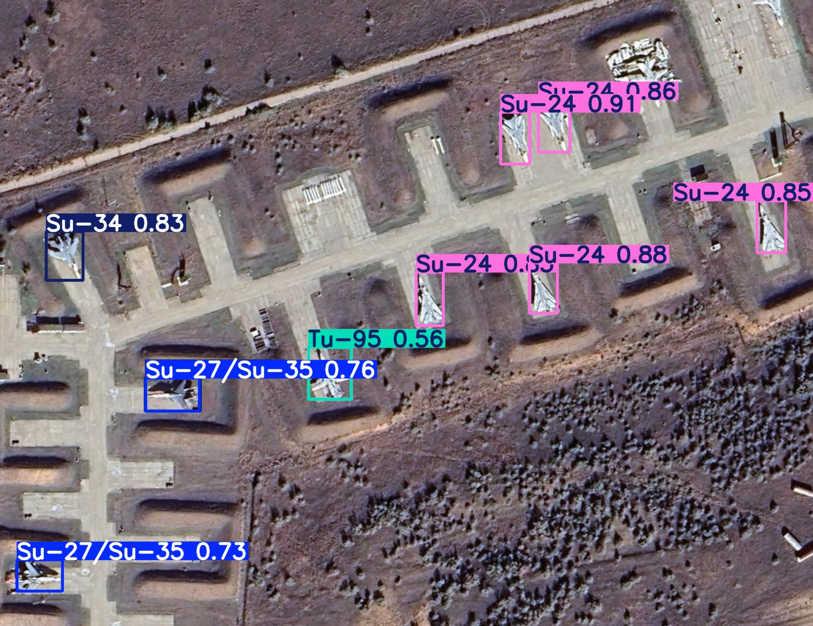

# aircraft-classification

## Summary

This repository contains code, scripts and experiments for detecting and classifying russian military aircrafts on satellite images of airbases. It also containes scripts and data for creating artifitial datasets.

## Project structure

- main.py — script to recognize planes on an image with model which can be choosen 

- test_model.py — script to test performance of a model if there is training set

- data/
  - artifitial-data/ — assets used to build synthetic datasets
    - airbase-images.zip - archive with airbase images and size labels for them 
    - plane-images.zip — archive with all types of planes and size labels
    - airbase-images/
      - images/ - folder with raw images of airbases (images do not contain aircrafts)
      - labels/ - folder with labels for airbase images that contain their real size (in meters) and points on which planes can be placed
  - datasets/ - folder containing datasets folders
    - dataset-folder
      - test-results - folder with results of test made on test set of data
      - class_names_mapping.json - mapping of class id to its name
      - config.yaml - config with training and augmentation parameters which were used to train corresponding model
      - data.yaml - data file for training YOLO model

- runs/detect - folder with trained models

- scripts/ — dataset creation, preprocessing, and utilities
  - artifitial_image_generator.py — classes wich are used to create artifitial satellite images
  - set_plane_locations.py — module with class used to set spawn locations for planes on images of empty airbases for generating artifitial satellite image
  - utils.py - utilites used in other scripts 
  - format_yolov8.py — module with functions used to convert initial dataset with .xml labels to YOLO format
  - xml_parser.py — module with class used to convert initial dataset with .xml labels to YOLO format

- src/
  - utils.py — shared helper functions used by main.py and test_model.py

## Installation

Recommended: create a Python venv and install dependencies listed in `requirements.txt` with next command (for ubuntu).

```bash
python3 -m venv .venv
source .venv/bin/activate
pip install -r requirements.txt
```

## Dataset
Initial dataset with real images was taken from Kaggle: [Military Aircraft Recognition dataset](https://www.kaggle.com/datasets/khlaifiabilel/military-aircraft-recognition-dataset) \
This dataset contains 3842 images, 20 types, and 22341 instances annotated with horizontal bounding boxes and oriented bounding boxes.

archive plane-images.zip from data/artifitial-datasets/ contains images and labels of next types of aircrafts:
- A-50
- Il-76
- L-39
- MiG-29
- MiG-31
- Su-24
- Su-25
- Su-27/35
- Su-30/34
- Tu-160
- Tu-22
- Tu-95

Su-27 and Su-35, Su-30 and Su-34 where combined into 2 classes instead of 4 because of small visual difference and complexity of differentiating them for a model.

## Artifitial dataset generation
There are lack of real satellite images of military planes of different classes so I created scripts to generate artifitial imagery.\
I have used public setellite imagery from google earth and created png images of planes of different types with transparent background. Airabse images I've also obtainede from google earth.

### Aircraft placement
To create artifitial image of an airbase planes are placed on randomly choosed points from set of points defined for each airbase with ```scripts/set_plane_locations.py``` module. There are 2 two types of points small (only planes defined as small can be placed) and big (all planes can be placed). Aircrafts are placed with small random noise for position to make images more distinct. 
### Shadows
Also shadows are added to make image more realistic. Firstly shift is randomly chosen for all shadows on an image, all shadows will be placed with this shift in relation to plane. Shadow of plane is obtained by lowering saturation and brightness of its image and applying blure to alpha channel to make shadow more realistic.
### Augmentation
For each airbase image new plane image parameters and shadow image parameters (saturation, brightness, contrast, blure, sharpness) is randomly generated and appilied. Also after placing planes gaussian noise and blure is added to make final image. Augmentation is made to make dataset more diverse and prevent model overfiting.

## Models
Project includes 5 trained models:

- **train-all-20cls-60ep-s** — model can recognize 20 classes of aircrafts (russian and NATO) from initial dataset taken from kaggle. Trained for 60 epochs, YOLOv8s.

- **train-russian-11cls-76ep-artifitial-imgsz800-m**  — model can recognize 11 classes of russian aircrafts (A-50, Il-76, MiG-29, MiG-31, Su-24, Su-25, Su-27/35, Su-30/34, Tu-22, Tu-95, Tu-160). Trained for 76 epochs, with image size 800, YOLO11m

- **train-russian-6cls-60ep-s** — model can recognize 6 classes of russian aircrafts (Su-24, Su-27/35, Su-30/34, Tu-22, Tu-95, Tu-160). Trained on 1167 real images from initial dataset that contain only russian planes. Trained during 60 epochs, YOLOv8s.

- **train-russian-6cls-100ep-artifitial-imgsz800-m**
— model can recognize 6 classes of russian aircrafts (Su-24, Su-27/35, Su-30/34, Tu-22, Tu-95, Tu-160). Trained on 4000 artifitialy generated images. Trained for 100 epochs, with image size 800, YOLO11m.

- **train-russian-6cls-100ep-combined-imgsz800-m**  — model can recognize 6 classes of russian aircrafts (Su-24, Su-27/35, Su-30/34, Tu-22, Tu-95, Tu-160). Trained on 4176 images (1176 real, 3000 artifitial). Trained for 100 epochs, with image size 800, YOLO11m.

## Detection results
### Below there are examples of detection for each model
### **train-all-20cls-60ep-s**:


### **train-russian-11cls-76ep-artifitial-imgsz800-m**:


### **train-russian-6cls-60ep-s**:



### **train-russian-6cls-100ep-artifitial-imgsz800-m**:


### **train-russian-6cls-100ep-combined-imgsz800-m**:


## Performance comparison

## Sources
Kaggle, Military Aircraft Recognition dataset: https://www.kaggle.com/datasets/khlaifiabilel/military-aircraft-recognition-dataset
